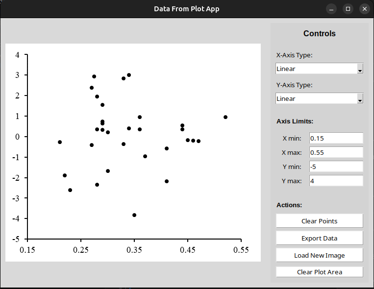

# Data from Plot



**Data from Plot** is a simple graphical tool that lets you extract numerical data from plot images. With this app, you can:
- Load a plot image (such as a PNG exported from a paper or report)
- Interactively select the exact plot area (excluding axes, labels, etc.)
- Set axis types and limits (including support for linear and logarithmic scales)
- Click to mark and extract data points, with coordinates automatically converted to your axis settings
- Export the collected data to CSV for further analysis

This tool is ideal for digitizing data from published plots when the original data is not available.

## Requirements

- Python 3.12 or later
- Tkinter (usually included with Python)
- No external dependencies required

## Getting Started

You can get the code in two ways:

### 1. Clone the repository

If you have git installed, open a terminal and run:
```
git clone https://github.com/marcsgil/data_from_plot.git
```
Then, change into the project directory:
```
cd data_from_plot
```

### 2. Download as ZIP

- Go to the GitHub page for this project.
- Click the green **"Code"** button and select **"Download ZIP"**.
- Extract the ZIP file and open a terminal in the extracted folder.

## Running the App

Make sure you are inside the project folder (where `main.py` is located), then run:
```
python main.py
```

## Usage

1. **Load an Image**  
   - Click the **"Load Image"** button in the control panel.
   - Select a PNG file of your plot.

2. **Select the Plot Area**  
   - After loading an image, you will be prompted to select the plot area by dragging a rectangle over the plot region (excluding axes, labels, etc.).
   - The selected area will remain shaded for reference.
   - To change the plot area, click the **"Clear Plot Area"** button and select a new region.

3. **Set Axis Types and Limits**  
   - Choose the X and Y axis types (Linear or Log10) from the dropdown menus.
   - Enter the minimum and maximum values for each axis.  
     You can use scientific notation (e.g., `1e-3` for `0.001`).

4. **Extract Data Points**  
   - Click inside the selected plot area to mark data points.
   - Each click will place a numbered marker and print the corresponding coordinates (converted according to your axis settings).
   - Markers and labels scale automatically with the image size for better visibility.

5. **Export Data**  
   - Use the **"Export Data"** button to save the collected data points to a CSV file.

6. **Other Actions**  
   - Use the **"Clear Points"** button to remove all data points from the current image.
   - Use the **"Clear Plot Area"** button to remove the current plot area selection and select a new one.
   - Loading a new image will also clear all points and require a new plot area selection.

---

**Note:**
- You must select a plot area before marking data points.
- The shaded rectangle will always indicate the current plot area.

## Troubleshooting

- If the app window does not appear, make sure you are running Python 3 and that Tkinter is installed (it is included by default in most Python distributions).
- If you see errors about missing modules, check your Python version with `python --version`.
- For any other issues, please open an issue on GitHub.

## License

This project is licensed under the MIT License. See the LICENSE file for details.

## Contributing & Support

Contributions are welcome! If you find a bug or have a feature request, please open an issue or pull request on GitHub.